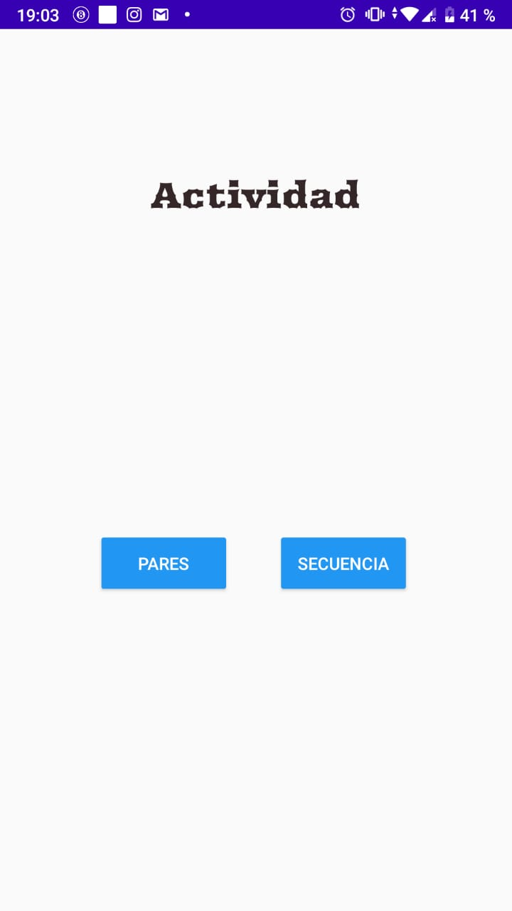
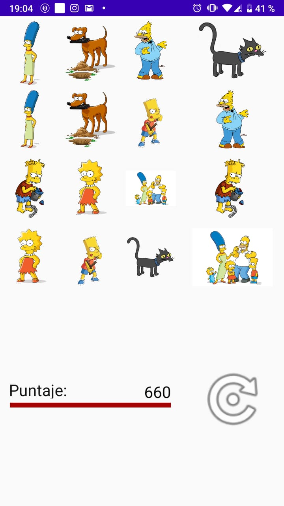
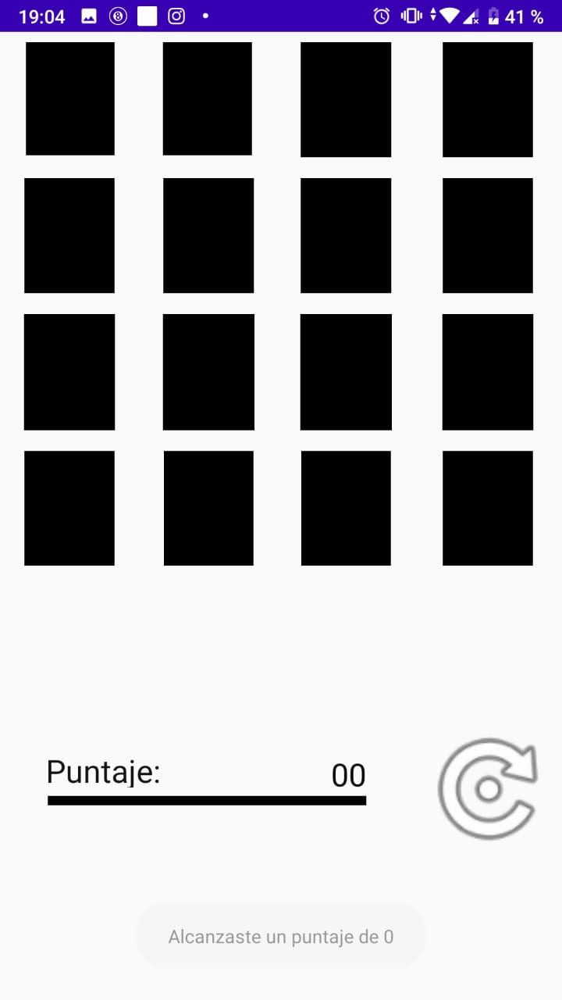

# MemoryGames-NavigationProject

Actividad para mostrar en la clase de Programación Móvil.

## Setup

```bash
git clone
``` 
to this repository.

## ScreenShots





## Contributing
Pull requests are welcome. For major changes, please open an issue first to discuss what you would like to change.

Please make sure to update tests as appropriate.

## License
[MIT](https://choosealicense.com/licenses/mit/)
